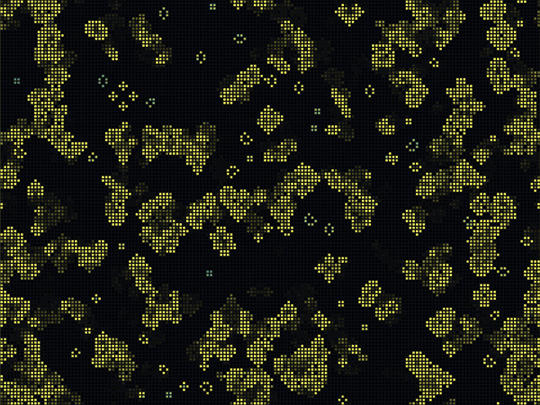
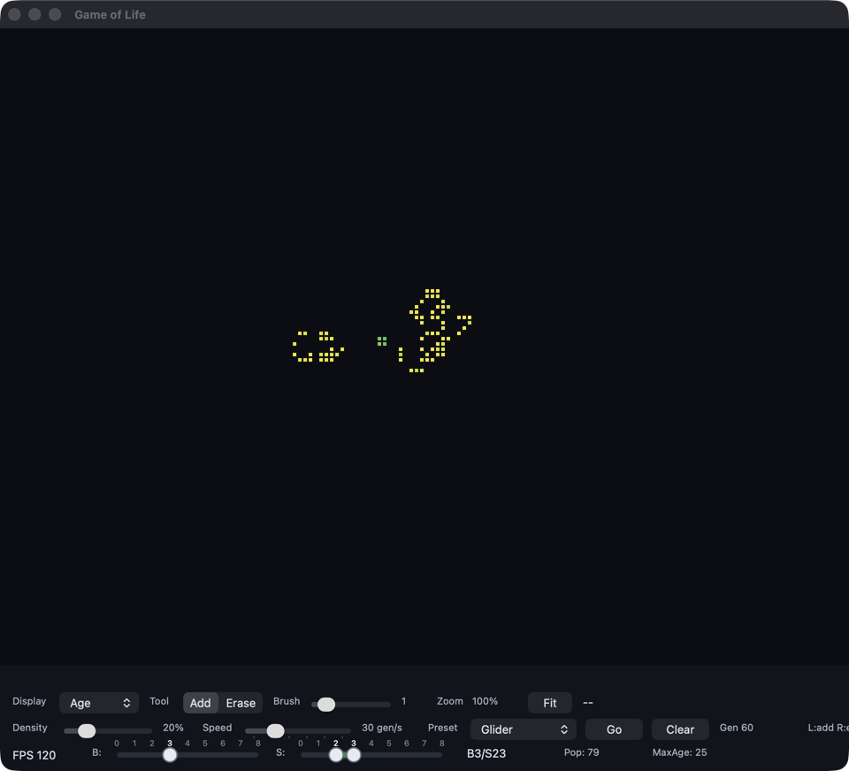
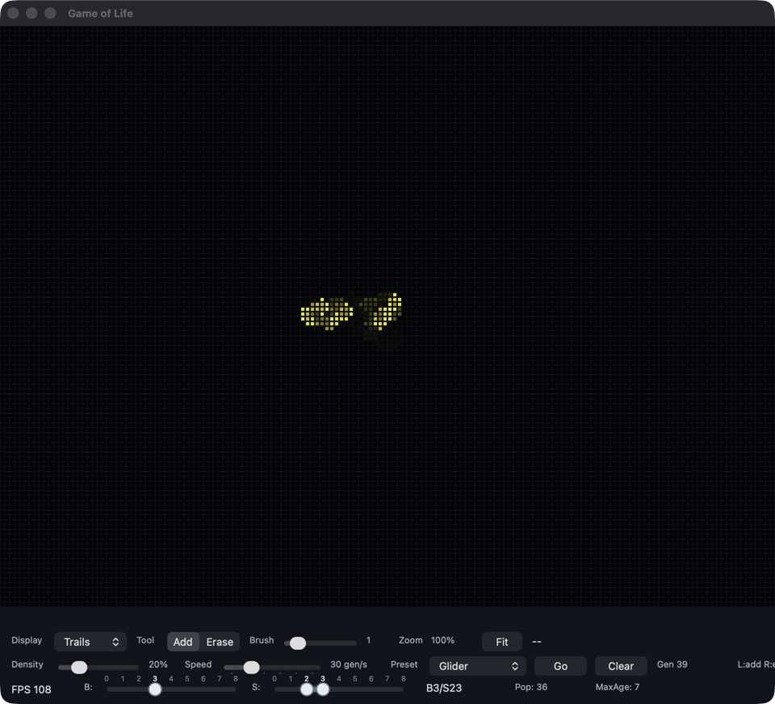
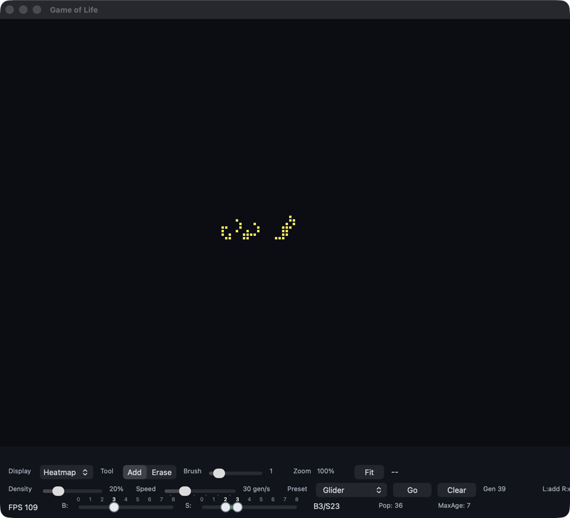

# GOL: Game of Life on the GPU

<p align="center">
  
</p>

A fast, interactive Conway's Game of Life for macOS, rendered entirely with
Metal. The simulation runs in a GPU compute shader over a triple-buffered
16-bit cell grid, with an interactive camera (pan/zoom), arbitrary B/S rules,
classic presets, and three display modes.

## Features

- **GPU simulation**: the step kernel runs on the GPU (with a CPU fallback),
  so large grids stay interactive.
- **Aging cells**: every cell packs its age into 15 bits (up to 32,767
  generations), which the Age and Heatmap display modes visualize.
- **Viewport-scaled grid**: the computational window grows and shrinks with
  what you can see: zoom out and the grid expands to cover the viewport (up to
  a ~4M cell / ~8 MB per plane cap), zoom in and it contracts. Patterns are
  preserved across resizes.
- **Camera**: scroll to zoom at the cursor, Option-drag (or middle-drag) to
  pan. At sub-pixel zoom levels the renderer switches to linear filtering with
  premultiplied alpha compositing so shrunken patterns stay smooth instead of
  aliasing.
- **Arbitrary rules**: two multi-select sliders define any birth/survival
  subset of the 8 neighbors (defaults to Conway's B3/S23).
- **Presets**: Glider, Blinker, Block, Beacon, Toad, Pentadecathlon, LWSS,
  R-Pentomino, and Heptomino.
- **Display modes**: Age (viridis color by cell age), Trails (phosphor-style
  persistence), and Heatmap.
- **Live stats**: generation, population, max age, and FPS.

## Screenshots

The **Display** button switches between three renderings of the same
R-Pentomino simulation:

| Age | Trails | Heatmap |
| :---: | :---: | :---: |
|  |  |  |

## Requirements

- macOS with the Xcode Command Line Tools (`xcode-select --install`), which
  provides `clang`, the Metal SDK, and `xcrun`.

## Build and Run

```sh
make run        # builds bin/gol + bin/shaders.metallib and launches the app
```

Other targets:

```sh
make all       # build only (bin/gol, bin/shaders.metallib)
make test      # run the CPU and Metal test suites
make clean     # remove bin/ and build/
```

The whole project compiles with `-Weverything` (C, Objective-C, and Metal)
and ships warning-free.

## Controls

### Mouse (on the canvas)

| Action | Effect |
| --- | --- |
| Left drag | Paint with the active tool (Add or Erase) |
| Right drag | Paint with the opposite of the active tool |
| Scroll wheel | Zoom in/out at the cursor |
| Option + left drag, or middle drag | Pan the camera |
| Hover | Shows cell coordinates and age in the status bar |

### Keyboard (with the canvas focused)

| Key | Effect |
| --- | --- |
| `P` | Pause / resume |
| `R` | Randomize the grid |
| `Delete` | Clear the grid |
| `Return` / `Enter` | Fit the grid to the window |

### Toolbar

- **B / S sliders**: multi-select the neighbor counts that trigger birth and
  survival. The rule label shows the current rule (e.g. `B3/S23`).
- **Density**: fill probability used by Randomize (default 20%).
- **Speed**: generations per second, 1-120 (default 30).
- **Preset**: drop-down of classic patterns; applying one clears the grid and
  places the pattern.
- **Go / Clear**: run/pause and wipe the grid.
- **Display**: Age, Trails, or Heatmap.
- **Tool**: Add or Erase (right-drag always does the opposite).
- **Brush**: paint radius, 0-10 cells.
- **Fit**: rescale the view so the whole grid is visible.

## How It Works

- **Cell format**: one `uint16_t` per cell: bit 0 is alive, bits 1-15 are
  age. A single shared `MTLBuffer` holds three grid planes.
- **Triple buffering**: each generation steps plane *n* → plane *n+1 mod 3*
  in a compute kernel. The renderer always draws the newest plane, and a ring
   of command buffers tracks in-flight work so the CPU never touches a plane
   the GPU is still writing. All mutating operations (paint, randomize,
   clear, preset, resize) drain the command queue first.
- **Rendering**: a small render pass copies the live plane into a cell
  texture (only when it changes), then a full-screen fragment shader scales
  it to the viewport with camera transforms. Trails accumulate in a second
  texture via an additive compute pass.
- **Resize safety**: grid resizes copy the old pattern into a persistent
  scratch buffer with origin-aware region copying, so panning/zooming never
  loses or duplicates pattern data.
- **CPU fallback**: when no Metal step pipeline is available, the same
  simulation runs on the CPU (`src/gol.c`), keeping behavior identical.

## Tests

```sh
make test
```

- `tests/gol_test.c`: rule helpers, cell packing, resize/region copying,
  randomization, and preset geometry.
- `tests/ref_test.c`: validates the CPU simulator against a reference
  implementation, including preset oscillation periods (block, blinker, toad,
  beacon, pentadecathlon) and glider/LWSS translation.
- `tests/metal_test.m`: runs the actual Metal step/trail kernels from the
  built `shaders.metallib` and compares them against the CPU reference.

## Project Layout

```
src/main.m        App, UI, camera, Metal setup, render loop (Objective-C)
src/gol.c/.h      CPU simulation helpers (rules, packing, resize, presets)
shaders.metal     Step, cell-texture, trail, and scale shaders
tests/            CPU reference tests and Metal kernel tests
Makefile          Warning-free build, test, and run targets
```
